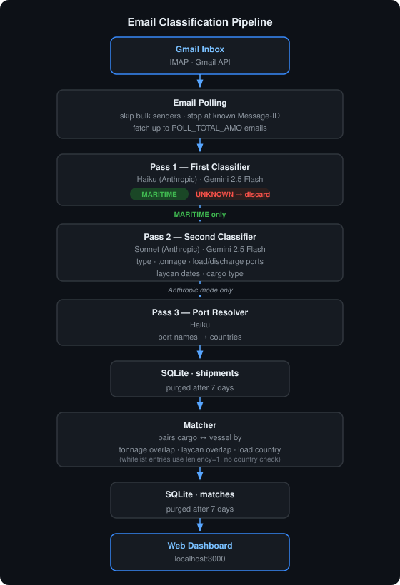
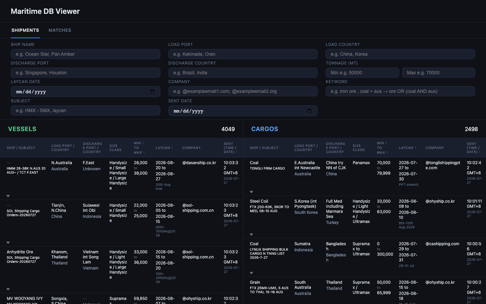
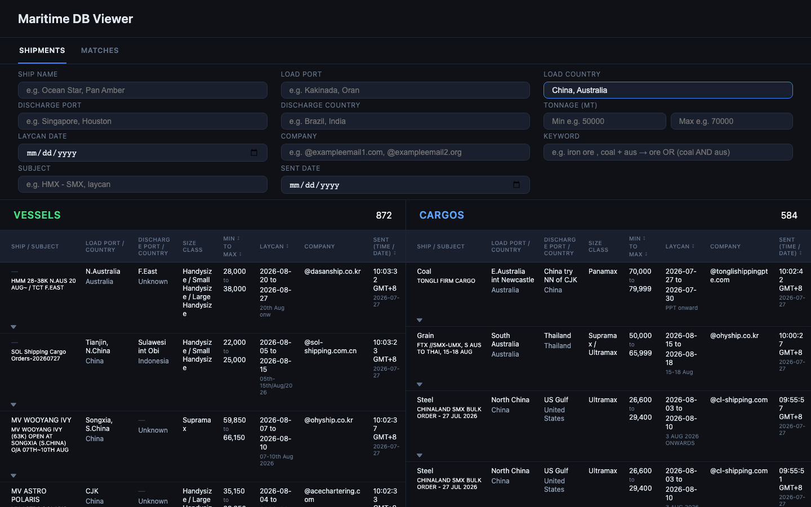
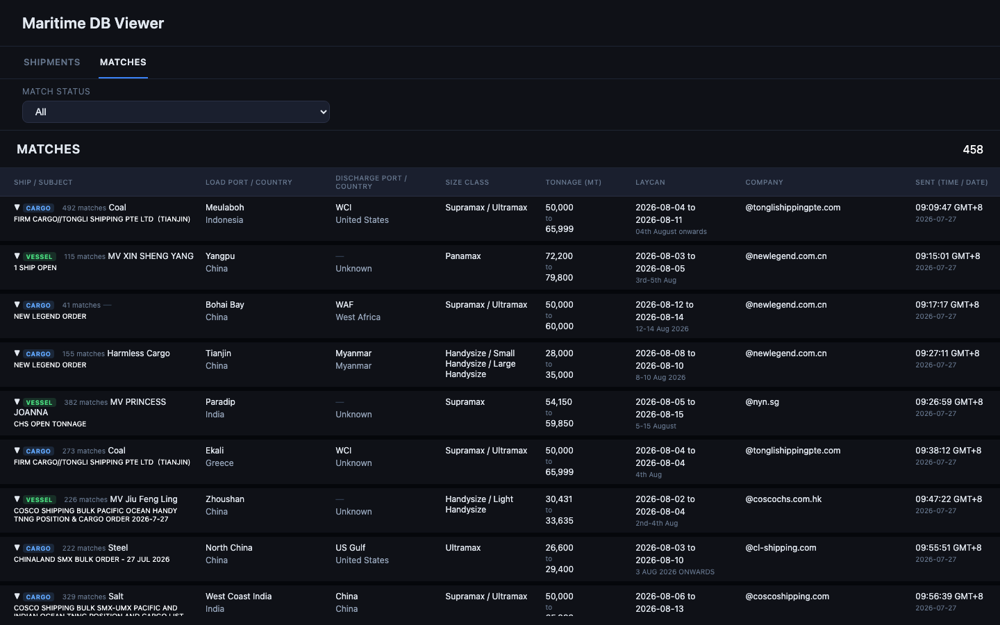

# maritime-email-matcher

A Node.js service for Argo Oriental that polls a Gmail inbox, classifies incoming maritime shipping emails using Claude or Gemini, stores them in SQLite, and surfaces matches between cargo listings and vessel offerings through a web dashboard.

## Quick Start

```bash
cp .env.example .env   # fill in credentials
npm install
npm start              # run the classifier pipeline
npm run website        # run the dashboard on localhost:3000
```

## Architecture

<div align="center">



</div>


1. **`index.js`** — reads env vars, picks classifier backend (`KEY_TYPE`), runs the poll/classify/save loop, and schedules recurring polls and purges.
2. **`Email_Polling/poll.js`** — fetches emails from Gmail (IMAP or Gmail API), skipping senders whose address contains `"bulk"` and stopping when a known `Message-ID` is seen.
3. **`External_Calls/classifier.js`** (Anthropic) — three-pass pipeline:
   - Pass 1 (Haiku): `"MARITIME"` or `"UNKNOWN"`
   - Pass 2 (Sonnet): extract type, tonnage, ports, laycan, cargo
   - Pass 3 (Haiku): resolve port names to countries
4. **`External_Calls/classifier_gemini.js`** (Gemini 2.5 Flash) — two-pass equivalent with auto-retry on rate limits.
5. **`Database/db.js`** — SQLite schema and helpers for `shipments`; records older than **7 days** are purged automatically.
6. **`Database/db_matches.js`** — `matches` table; records older than **7 days** are purged automatically.
7. **`Matcher/matcher.js`** — pairs cargo and shipping entries using tonnage overlap, laycan overlap, and load country; writes results to `matches`.
8. **`Website/server_new.js`** — Express dashboard; start with `npm run website`.

## Environment Variables

| Variable | Default | Purpose |
|---|---|---|
| `IMAP_HOST/PORT/SECURE/USER/PASS` | — | IMAP credentials |
| `KEY_TYPE` | `0` | `0` = Gemini, `1` = Anthropic Claude |
| `ANTHROPIC_API_KEY` | — | Required when `KEY_TYPE=1` |
| `GEMINI_API_KEY` | — | Required when `KEY_TYPE=0` |
| `POLL_TYPE` | `0` | `0` = IMAP batch mode, `1`/`2` = Gmail real-time mode with scheduler |
| `POLL_TOTAL_AMO` | `100` | Max emails to fetch per run |
| `POLL_BATCH_SIZE` | `50` | Classification batch size |
| `POLL_0_DEBUG_START` | `0` | Offset into mailbox for IMAP batch mode |
| `RUN_INTERVAL` | `30` | Minutes between scheduled polls (POLL_TYPE 1/2) |
| `PURGE_INTERVAL` | `6` | Hours between automatic purge runs |
| `CLASSIFY_FIRST_AMO` | `50` | Concurrency limit for pass-1 classification |
| `CLASSIFY_SECOND_AMO` | `5` | Concurrency limit for pass-2 classification |
| `CLASSIFY_THIRD_AMO` | `50` | Concurrency limit for pass-3 classification |
| `SITE_PASSWORD` | — | Dashboard login password |
| `DEBUG_LOGS` | `false` | Log each email subject and classifier result |
| `LITE_DEBUG` | `true` | Lighter debug output |
| `DEBUG_PASS1` | `false` | Log pass-1 classifier output |

## Polling Modes

**`POLL_TYPE=0` — IMAP batch (one-shot):** fetches `POLL_TOTAL_AMO` emails starting at `POLL_0_DEBUG_START`, classifies them, then exits. Useful for backfilling.

**`POLL_TYPE=1` or `2` — Gmail real-time (persistent):** polls on startup and every `RUN_INTERVAL` minutes during Beijing business hours (Mon–Fri 08:00–17:00 CST). Sleeps outside that window and wakes at the next window open. Purges run every `PURGE_INTERVAL` hours.

## Database

SQLite file is created automatically at `Database/maritime.db` on first run.

```bash
# Reset the entire database
rm Database/maritime.db

# Drop only the matches table (e.g. after a schema change)
node Database/drop_matches.js

# Edit a record directly
node Database/edit.js
```

## Testing

```bash
npm test
```

Tests use Node's built-in `node:test` module and live in `test/*.test.js`. All tests must pass before a change is considered done.

## Dashboard

```bash
npm run website   # starts Express on localhost:3000
```

**Shipments view** — vessels and cargos side by side, filterable in real time:



**Filtered view** — comma-separated values in any field apply OR logic across both sides:



**Matches tab** — cargo/vessel pairs found by the matcher, with match count and full shipment details:



To share externally (e.g. with people in China) without a domain:

```bash
brew install cloudflared
cloudflared tunnel --url http://localhost:3000
```

This prints a random `https://*.trycloudflare.com` URL. The URL changes each restart. China reachability via Cloudflare's standard edge is not guaranteed — test from a China-based connection.
